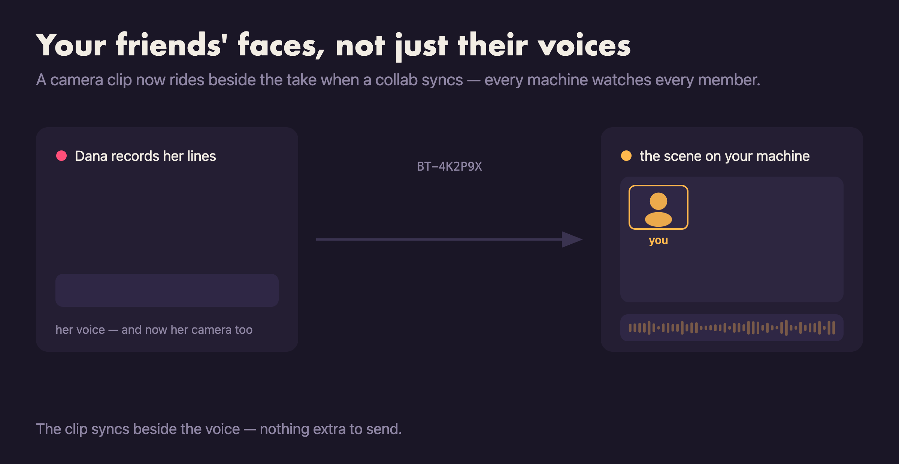
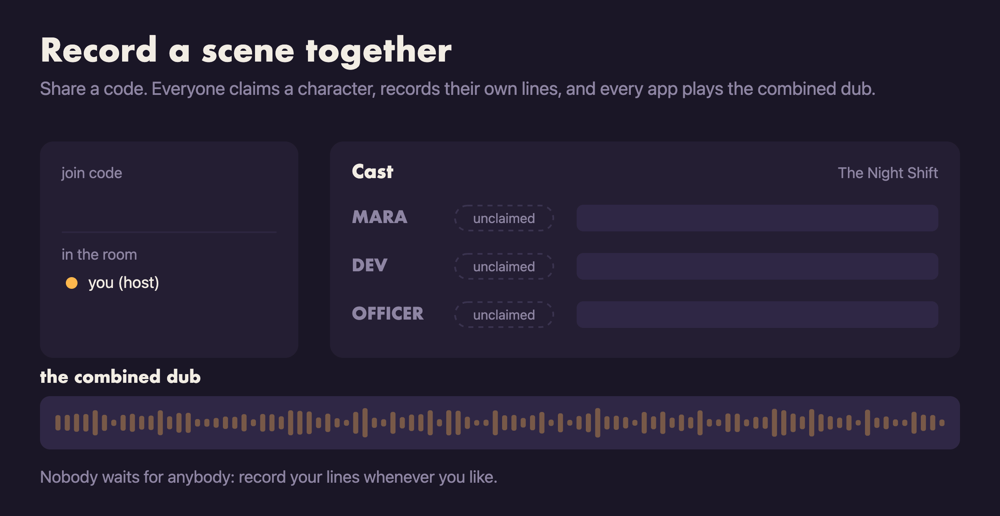
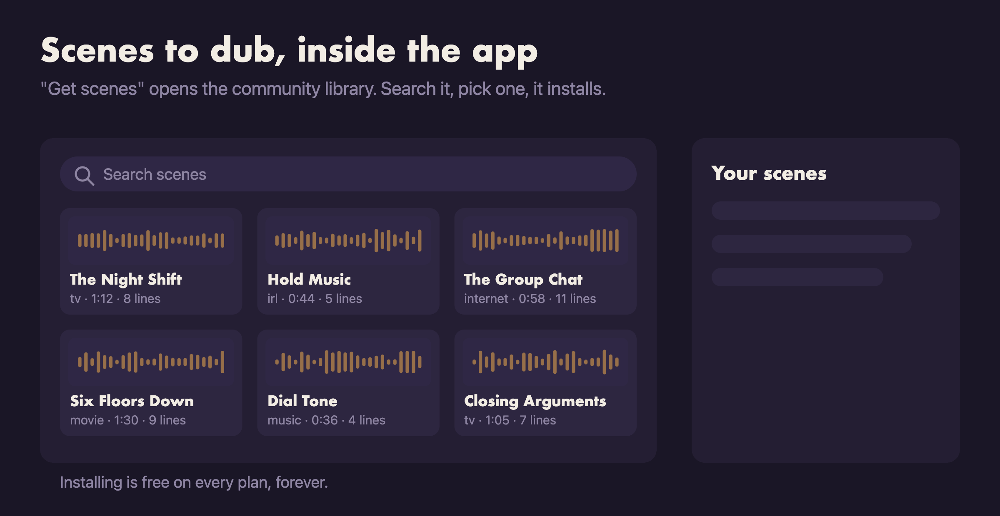
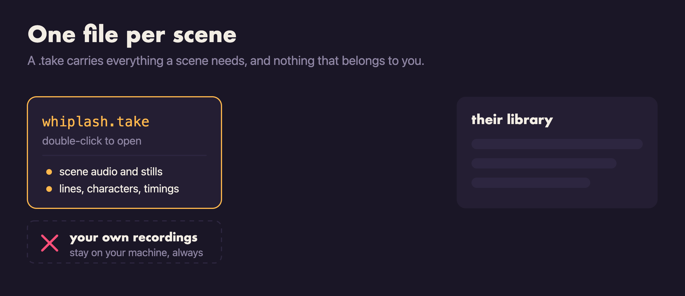
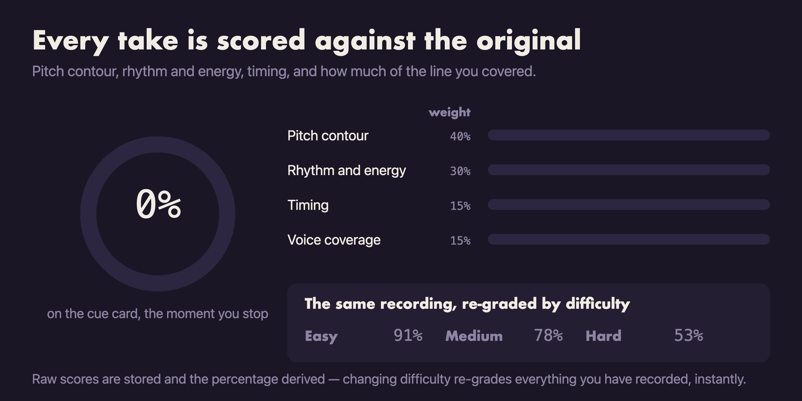
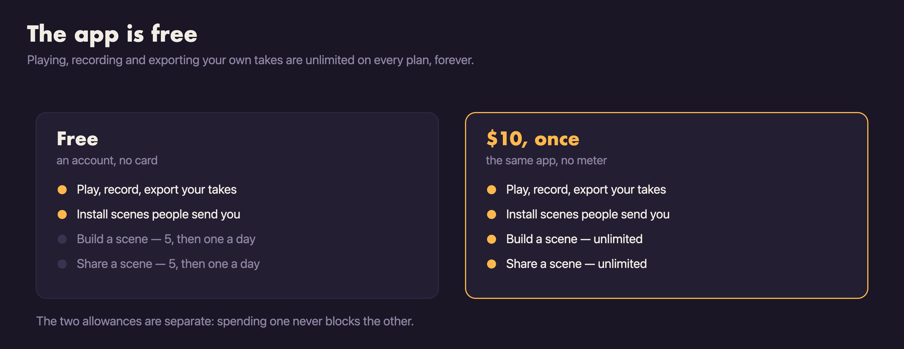
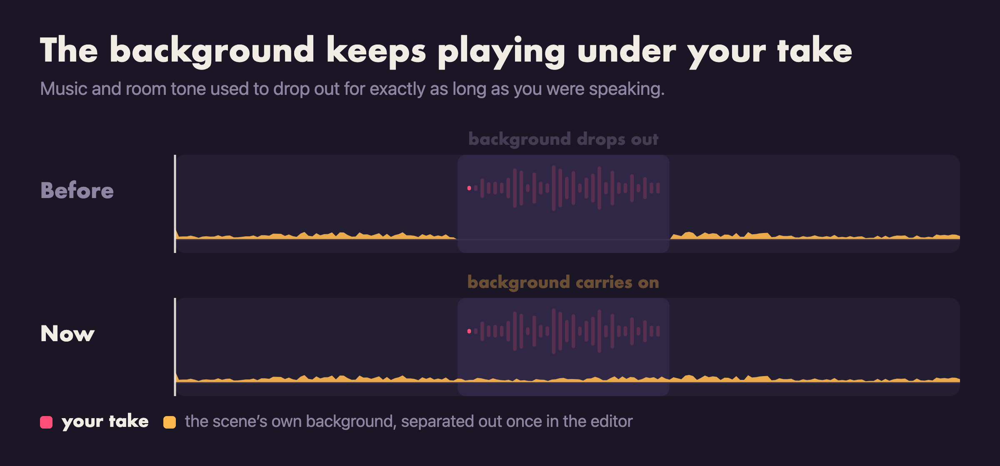
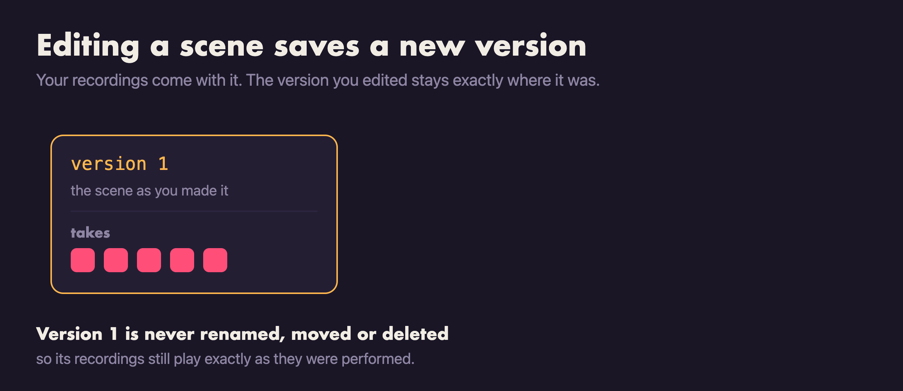
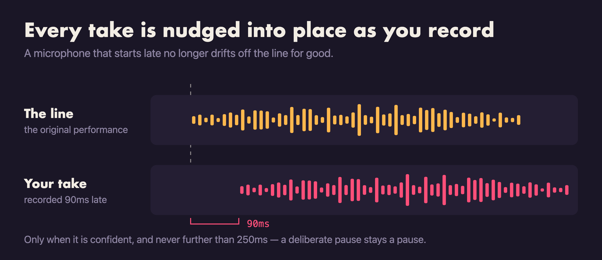
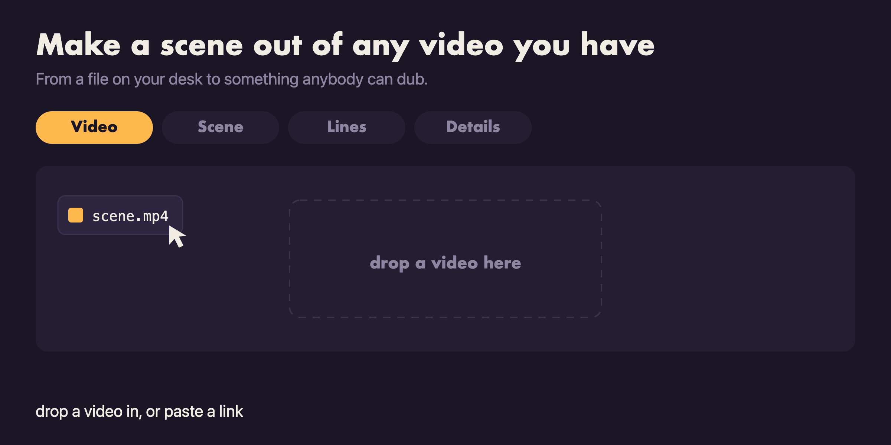

# Bad Takes — release notes

What changed in each version. Downloads for every release are on the
[Releases](../../releases) page.

## v0.13.0 — 27 August 2026

### Your friends' faces, not just their voices

A collab's combined dub played every member's voice but nobody's face — the
camera clip recorded with a take stayed on the machine that recorded it. The
clip now syncs along with the take, so the screening room plays every
member's footage, and a saved take or an export keeps every face too.

### A fresh install lands on the real library

A brand-new account used to meet a "No scenes yet" panel that replaced the
whole home page — hiding the exact doors it was pointing at. The full library
page is the landing now, so Make a scene — where importing, Get scenes and
joining a collab all live — is right there from the first launch.

## v0.12.2 — 27 August 2026

### Everybody gets credited for the lines they read

A collab dub is several people's work, and the app never once said whose. Now
it does, in every place the dub turns up: the screening room names the
collaborator reading each line in the script and on the stage itself, and both
the video export's end card and the vertical reel carry those names too.

Post the clip and the people in it are credited on it.

### Updates arrive without waiting for you to quit

Installing on quit was the whole delivery story, and it only ever reached
people who quit. A machine left running never restarts, so the update sat
downloaded on disk indefinitely.

Downloading now happens on its own, and when an update is ready and you are
not in the middle of anything, the app offers to restart into it. The
"Update automatically" setting still means what it always meant — leave it off
and nothing swaps the app out from under you — but the Settings row now
describes what it actually controls.

### Collabs hold together

Four fixes to rooms that misbehaved:

- A scene whose collab has wrapped can host a new one. It used to refuse for
  days, long after the dub was finished.
- Guests can no longer edit a scene out from under a room that is still
  running. The check only ever covered hosts, and a guest's edit breaks a room
  exactly as a host's does.
- Back leaves a dub you were watching and returns home, instead of stranding
  you there.
- The public collab list shows scene thumbnails. It never has — every single
  one was silently skipped before it was ever uploaded.

## v0.12.1 — 26 August 2026

### Anyone can host a collab

v0.11.0 shipped collabs with hosting behind the $10 unlock. That is gone — any
account can start a room on any scene now, and joining one was always free.

A collab is the one thing in Bad Takes that brings other people in: everyone
you send a code to installs the app to use it. Charging for the invitation was
the wrong way round.

### Buying the unlock takes effect straight away

Paying used to leave the app still showing the free plan — and still counting
your scenes against the free five — until you signed out and back in. If you
bought the unlock and then got refused on your sixth scene, that is fixed. No
sign-out needed, and nothing you paid for was lost.

### Signing in on another computer says so

Your account runs on one machine at a time. Signing in on a second one used to
leave the first looking perfectly signed in while everything it tried quietly
failed, under a message that named the feature rather than the reason. It now
returns to the sign-in screen and tells you what actually happened.

## v0.12.0 — 26 August 2026

### Collab was hidden — fixed

v0.11.0 shipped collabs and then most people could not find them. The app
remembers which features the server has switched on, and something it wrote on
every launch was overwriting that answer seconds later — so collab switched
itself back off each time you started up, and the Collab button on a scene
simply was not there. It is now.

The app also re-checks whenever you come back to the window, rather than up to
an hour later.

### A collab room keeps up

News from a room — somebody joining, claiming a character, starting a take —
now arrives about three times sooner. Opening a room you are already in
refreshes it straight away instead of showing you claims up to a minute old,
and somebody taking a free character is announced, which it never was.

## v0.11.0 — 25 August 2026

### Record a scene with other people

Collabs are here. Start one on any scene and you get a join code; send it to
whoever you want in it. They join free, claim a character, and record only that
character's lines. Every app in the room pulls everyone else's takes and plays
the combined dub — and exports it, the same as any other take.

Nobody has to be there at the same time, and nobody can record over anybody:
a character has exactly one owner, and a line plays its owner's take. Up to
eight people to a room. Hosting needs the $10 unlock — joining one never does.

### Pick your handle

Your account now has an `@handle`, and you will be asked for one on your next
launch. It is the name the rest of the room sees when you join their collab,
instead of half of your email address. You can change it later in Settings.

Also: new accounts are subscribed to release announcements, with an unsubscribe
link in every one.

## v0.10.0 — 24 August 2026

### The scene catalog

Scenes to dub are now inside the app. "Get scenes" on the Make a scene page
opens the community library — search it, sort it, click one and it installs.
Installing is free on every plan, and always will be.

### One file per scene

Sharing a scene now produces a single `.take` file. Double-click it and it opens
in Bad Takes; there is nothing to unzip and nowhere to put it by hand. As
before, your own recordings never travel with it.

Also: Cmd+, on macOS and Ctrl+, on Windows open Settings.

## v0.9.0 — 24 August 2026

### Scoring, with difficulty settings

Every take you record is now scored against the original performance. Four
things are measured — the shape of your pitch, your rhythm and energy, your
timing, and how much of the line you actually covered — and the result lands on
the cue card the moment you stop recording. The screening room adds up the
scene, broken down by character, so you can see which line dragged the total
down.

Difficulty is in Settings: Easy, Medium or Hard. Changing it re-grades every
take you have ever recorded, instantly — the recording keeps its raw score and
only the grade moves, so switching difficulty costs you nothing and tells you
something new. Settings also tracks your last six sittings and whether you are
getting better.

A take too quiet or too short to measure reads as a dash, never as zero.

## v0.8.0 — 23 August 2026

Performance improvements and internal groundwork. Nothing user-facing in this
one — worth installing to stay current, but you are not missing a feature by
skipping it.

## v0.7.0 — 21 August 2026

### Auto-update fixed

Installed copies were checking for updates against a file that did not exist.
The update feed pointed at one filename and the release hosted another, so every
check quietly found nothing and every copy stayed where it was. The names now
match, and updating works.

**If you are on v0.5.0 or v0.6.0, this release will not reach you
automatically** — download it manually, install over the top, and updates from here
will arrive on their own.

The Windows download link was pointing at a filename that was not there either;
that is fixed in the same change.

## v0.6.0 — 20 August 2026

### The app is free

An account now costs nothing. Playing a scene, recording your take, and
exporting what you made — audio, video, or a vertical reel — are unlimited on
every plan, forever. So is installing a scene somebody sends you.

Two things are metered on the free plan: building a scene and sharing one. You
get five of each straight away, then one a day. The $10 purchase removes both
limits and is a one-time payment.

The two allowances are separate — spending one never blocks the other — and
Settings shows where each of them stands, alongside a report of what you made
this month.

## v0.5.0 — 19 August 2026

### The background keeps playing under your take

A scene's music and room tone used to drop out for exactly as long as you were
speaking, because the only audio under a line was the original performer's — and
replacing them meant losing everything recorded with them.

The editor can now separate a scene's background from its dialogue, and that
background plays underneath your take. The music carries on through your line
instead of falling into a hole around it.

### Editing a scene saves a new version, and your takes come with it

Editing a scene no longer overwrites it. The edit is saved as a new version and
your recordings are carried across, matched to the lines they were performed
over — so fixing a caption or retiming a line does not cost you the takes you
already recorded.

The version you edited stays exactly where it was, with its own recordings
intact.

## v0.4.0 — 18 August 2026

### Every take is nudged into place as you record

Microphones do not start instantly. A freshly woken mic swallows the first
40–60 milliseconds, and the take that results sits late against the line for
the rest of its life — by an amount you can hear but cannot easily fix.

Bad Takes now measures each take against the line it was performed over and
shifts it onto the beat as it saves. Only when it is confident, and never by
more than 250ms, so a pause you left on purpose stays a pause you left on
purpose.

The macOS builds are Developer ID signed, notarized and stapled. The Windows
installer is not yet code-signed, so Windows SmartScreen will warn on first run
— choose More info → Run anyway.

## v0.3.0 — 17 August 2026

### Share a scene

A scene you made is now something you can hand to somebody. Export it from the
scene's page and you get a single file; whoever receives it drops it onto their
own copy of Bad Takes and it installs like any other scene.

Your own recordings never travel with it. What you share is the scene — the
audio, the stills, the lines and who says them — and nothing you performed.

### Pinch to zoom the waveform

The creator's waveform strip zooms under a trackpad pinch, so marking a line
that lasts half a second no longer means aiming at a two-pixel target.

## v0.2.0 — 17 August 2026

### Make a scene out of any video you have

Up to now you could only dub scenes somebody else had built. The scene creator
turns any video into one: drop a file in or paste a link, drag the handles to
the part worth dubbing, mark who says what on the waveform, then name it and
pick a thumbnail. What comes out is an ordinary scene — you can dub it, and so
can anyone you send it to.

